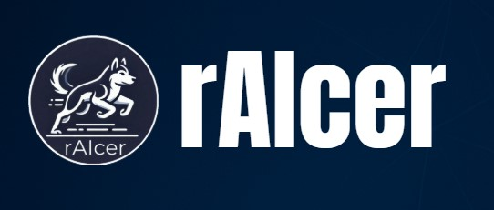

# 💡 rAIcer

<!-- cool project cover image -->

<!-- table of content -->
## Table of Contents
- [The Team](#the-team)
- [Project Description](#project-description)
- [Getting Started](#getting-started)
- [Prerequisites](#prerequisites)
- [Installing](#installing)
- [Testing](#testing)
- [Deployment](#deployment)
- [Built With](#built-with)
- [Acknowledgments](#acknowledgments)

## 👥 The Team 
**Team Members**
- [Tohar Simchi](toharya.simchi@mail.huji.ac.il )
- [Adar Mizrahi](adar.mizrahi1@mail.huji.ac.il)

**Supervisor**
- [Dr. Oron Sabag](Oron.Sabag@mail.huji.ac.il )

## 📚 Project Description
rAIcer is a project that explores the challenges of autonomous navigation using two robot cars controlled via reinforcement learning (RL). These simplified vehicles are designed to operate in a controlled physical environment and a also have a simulation setup.

## ⚡ Getting Started

These instructions will help you get a copy of the rAIcer project running on your local development machine and Jetson Nano for both simulation and real-world testing.

### 🧱 Prerequisites
- [Jetson Nano Nvidia](https://www.waveshare.com/jetson-nano-developer-kit.htm)
- [Arduino IDE](https://docs.arduino.cc/hardware/)
- [Python 3.10](https://www.python.org/downloads/release/python-3100/)
- [DC motor](https://electronics.stackexchange.com/questions/263771/specification-of-dc-motor)
- [Servo motor](https://circuitdigest.com/article/servo-motor-working-and-basics)
- [Camera](https://www.intelrealsense.com/)
- Serial connection (USB) between Jetson Nano and Arduino

### 🏗️ Installing
1. The simmulation - https://colab.research.google.com/drive/1OWp7wlhXpLPeueP0ZxFYp-6bc4MzQKhR
2. Clone the repository
   
       git clone https://github.com/toharys/rAIcer.git
       cd rAIcer

3. activate virtual environment in the jetson
 
      cd  home/raicer/move_robot/rAIcer
      source ~/.py3venv/bin/activate

4. running scripts

      on the jetson: python communicate_with_controller.py
      on the arduino, downlode: full_controller.ino

## 🧪 Testing
To verify the functionality of the project and the learning algorithm, use the following testing approach:

### Sample Tests
Agent Performance – test that the agent improves over time in simulation.

Motor Command Accuracy – verify that the correct commands are sent from Jetson to Arduino.

## 🚀 Deployment
To deploy on the physical robot:

1.Set up the Jetson Nano with camera and power.

2.Flash the Arduino with the latest motor control script.

3.From the Jetson Nano, run the robot execution script:

      python communicate_with_controller.py

4. Make sure the robot has a clear field of view and is properly aligned with the road.

## ⚙️ Built With
  - [the RL algoritem is based on an artical about DQN ](https://arxiv.org/pdf/1312.5602)

## 🙏 Acknowledgments
Inspired by Mnih et al.'s Deep Q-Learning work

Thanks to our supervisor Dr. Oron Sabag for guidance

Thanks to Yedidiya and Maor for hardware and electronics help
